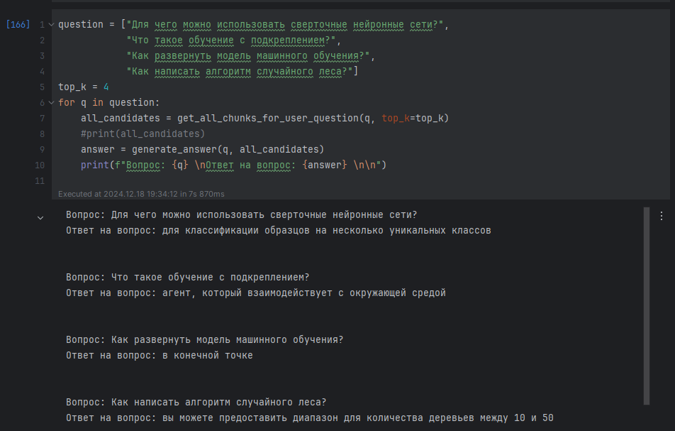

# Тестовое задание 
## Описание проекта

Данный проект представляет собой вопросно-ответную систему (Question Answering) по корпусу статей. Исходные данные представлены в файле `papers.csv`, содержащем заголовки статей и их полный текст. Цель - дать возможность пользователю задавать вопросы и получать ответы на основе информации, извлечённой из корпуса.

Для решения задачи выполнен следующий функционал:

1. Подготовка данных: разбиение статей на чанки, очистка и предобработка.
2. Генерация дополнительных вопросов по материалу статей (через `partial_results.csv`), чтобы улучшить поиск.
3. Создание индексов для поиска релевантных фрагментов по запросу пользователя с помощью разных методов (эмбеддинги, TF-IDF, BM25).
4. Ансамблирование результатов поиска по разным методам для улучшения качества поиска.
5. Внедрение модели для ответа на вопросы (QA-модель) на русском языке.
6. Разработка веб-сервиса на базе Streamlit для интерактивного общения с системой.
7. Обертывание решения в Docker и запуск через `docker-compose`.

## Файлы и структура

- `papers.csv` – исходный корпус статей.
- `partial_results.csv` – файл с генерированными вопросами (получен после предварительного запуска кода в Jupyter Notebook).
- `streamlit_app.py` – код веб-приложения на Streamlit, которое использует загруженные данные, модели и индексы для ответов на вопросы пользователя.
- `requirements.txt` – список необходимых библиотек и их версий.
- `Dockerfile` – описание Docker-образа.
- `docker-compose.yaml` – настройки для запуска сервиса через docker-compose.
- `README.md` (настоящий файл) – описание проекта и инструкции по запуску.
- `embeddings_titles.npy` – сохранённый numpy-массив эмбеддингов для вопросов.
- Jupyter Notebook `task.ipynb` – ноутбук с пошаговым решением ML-задачи: подготовка данных, генерация вопросов, построение индексов, ансамблирование и проверка решения. В конце ноутбука представлены ответы системы на вопросы:
  - Для чего можно использовать сверточные нейронные сети?
  - Что такое обучение с подкреплением?
  - Как развернуть модель машинного обучения?
  - Как написать алгоритм случайного леса?

## Запуск решения

### Предварительные шаги

1. Убедитесь, что у вас есть файлы `papers.csv` и `partial_results.csv`.
2. Установите Docker и docker-compose.

### Сборка и запуск Docker-контейнера

Выполните в терминале:

```bash
docker-compose build
docker-compose up
```

После успешного запуска перейдите в браузере по адресу [http://localhost:8501](http://localhost:8501).

На открывшейся странице появится веб-интерфейс, где вы сможете ввести любой вопрос, нажать кнопку "Отправить" и получить ответ системы.

### Структура решения внутри приложения

- `streamlit_app.py`:
  - Загружает данные и модели.
  - Восстанавливает заранее вычисленные эмбеддинги и индексы.
  - Реализует функцию поиска по ансамблю методов (эмбеддинги, TF-IDF, BM25).
  - Использует модель вопрос-ответ (QA) для генерации ответа на основе найденных фрагментов.
  - Предоставляет простой интерфейс для ввода вопроса и отображения ответа.

### Кэширование

В Streamlit используется декоратор `@st.cache_resource` для кэширования моделей и данных, чтобы снизить время перезапуска приложения.

## Выполнение ML-задачи

См. Jupyter Notebook `task.ipynb`, в котором представлены:

- Шаги подготовки данных (очистка, чанканье).
- Генерация дополнительных вопросов.
- Обучение или загрузка эмбеддингов.
- Создание индексов FAISS для поиска по эмбеддингам.
- Создание TF-IDF и BM25 индексов.
- Ансамблирование результатов.
- Итоговые ответы модели на контрольные вопросы.

В конце ноутбука (или в выведенных ячейках), представлены ответы модели на 4 заданных вопроса. Ответы предоставлены в формате исполненных ячеек.

## Ответы системы на контрольные вопросы

Пример (результат будет показан непосредственно в Jupyter Notebook по мере выполнения ячеек):

- Вопрос: "Для чего можно использовать сверточные нейронные сети?"  
  Ответ: *для классификации образцов на несколько уникальных классов*
  
- Вопрос: "Что такое обучение с подкреплением?"  
  Ответ: *агент, который взаимодействует с окружающей средой *
  
- Вопрос: "Как развернуть модель машинного обучения?"  
  Ответ: *в конечной точке *
  
- Вопрос: "Как написать алгоритм случайного леса?"  
  Ответ: *вы можете предоставить диапазон для количества деревьев между 10 и 50*
